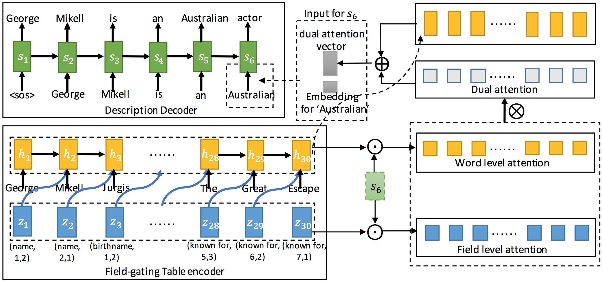

# wiki2bio
<p align="center"></p>

This project provides the implementation of table-to-text (infobox-to-biography) generation, taking the structure of a infobox for consideration.

Details of table-to-text generation can be found [here](https://tyliupku.github.io/papers/aaai2018_liu.pdf). The implementation is based on Tensorflow 1.0.0 and Python 2.7.

# Model Overview
<p align="center"></p>
wiki2bio is a natural language generation task which transforms Wikipedia infoboxes to corresponding biographies.
We encode the structure of an infobox by taking field type and position information into consideration.

In the encoding phase, we update the cell memory of the LSTM unit by a field gate and its corresponding field value 
in order to incorporate field information into table representation.
In the decoding phase, dual attention mechanism which contains word level attention and field level attention is proposed 
to model the semantic relevance between the generated description and the table.

# Data
The dataset for evaluation is [WIKIBIO](https://github.com/DavidGrangier/wikipedia-biography-dataset) from [Lebret et al. 2016](https://arxiv.org/abs/1603.07771). We preprocess the dataset in a easy-to-use way.

The ```original_data``` we proprocessed can be downloaded via [Google Drive](https://drive.google.com/file/d/15AV8LeWY3nzCKb8RRbM8kwHAp_DUZ5gf/view?usp=sharing) or [Baidu Yunpan](https://pan.baidu.com/s/1c324Vs8).

```
original_data
training set: train.box; train.summary
testing set:  test.box; test.summary
valid set:    valid.box; valid.summary
vocabularies: word_vocab.txt; field_vocab.txt
```

```*.box``` in the ```original_data``` is the infoboxes from Wikipedia. One infobox per line.

```*.summary``` in the ```original_data``` is the biographies corresponding to the infoboxes in ```*.box```. One biography per line.

```word_vocab.txt``` and ```field_vocab.txt``` are vocabularies for words (20000 words) and field types (1480 types), respectively. 

The whole dataset is divided into training set (582,659 instances, 80%), valid set (72,831 instances, 10%) and testing set (72,831 instances, 10%).

# Usage
To be done...

# Reference
If you find the code and data resources helpful, please cite the following paper:
```
@article{liu2017table,
  title={Table-to-text Generation by Structure-aware Seq2seq Learning},
  author={Liu, Tianyu and Wang, Kexiang and Sha, Lei and Chang, Baobao and Sui, Zhifang},
  journal={arXiv preprint arXiv:1711.09724},
  year={2017}
}
```
